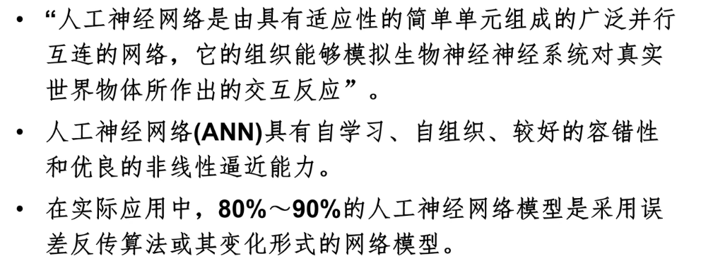
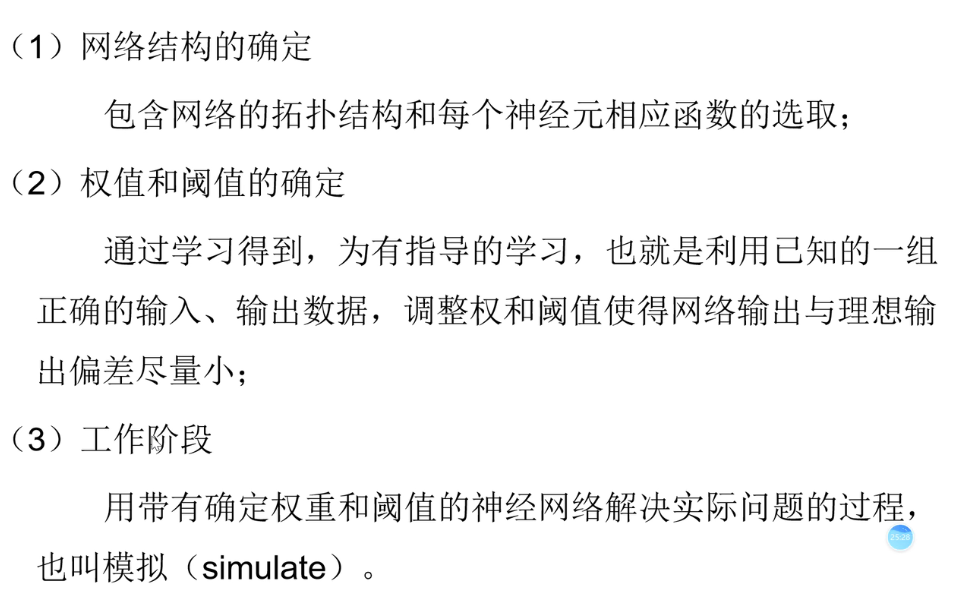
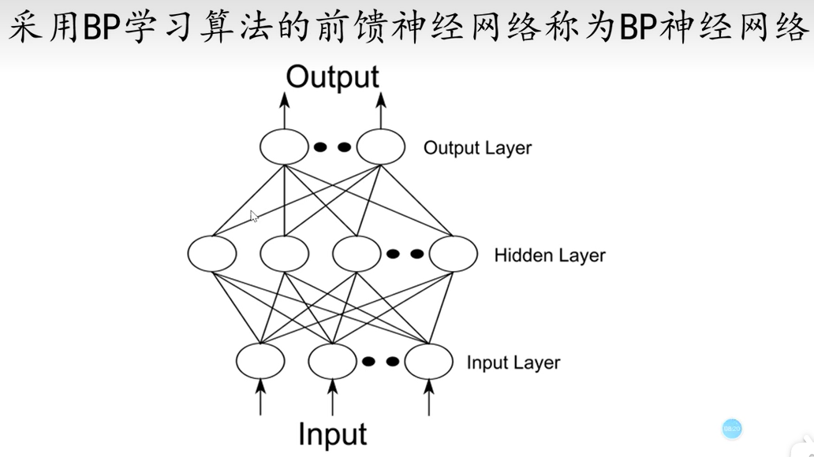

人工神经元 ANN

人工神经元，数学近似映射一般分为**拟合和分类**两部分，又称为**预测和聚类分析**。

数学近似映射，即将两组数据映射起来的问题。

建立和应用ANN的大致步骤

神经元的信息传递和处理是一种**电化学活动**，树突由于电化学作用接受外界的刺激；通过胞体内的活动体现为轴突电位，当轴突电位达到一定的值则形成神经脉冲或动作电位；再通过轴突末梢传递给其它的神经元，从控制论的观点来看；这一过程可以看作一个 **多输入单输出非线性 **系统的动态过程。

参数承担着拟合的过程，

参数被成为权重，

在我们选择某种算法的时候，我们就已经默认数据分布就符合那种关系了。

我们并不知道预先数据的输入和输出到底符合什么样的一个分布。

就用y和x建立一个权w俩表示它们之间的关系，仅仅假设它们之间是可以通过一个权来连接的。（理解权w是一个自动变化的？）

问题：激活函数为什么要是连续函数，它是怎么吧离散数据变连续的，为什么要求导？

### BP神经网络

BP神经网络上每一条线，都是一个权值。

### 构建和训练

有最大循环次数，

里期望目标误差的最小值。

网络训练好后用sim来仿真。