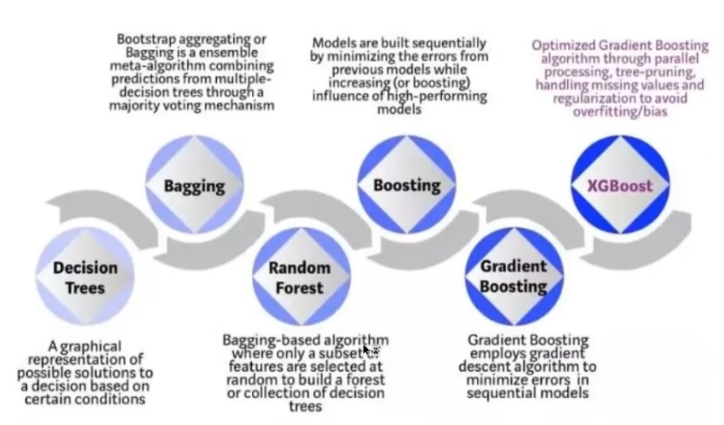
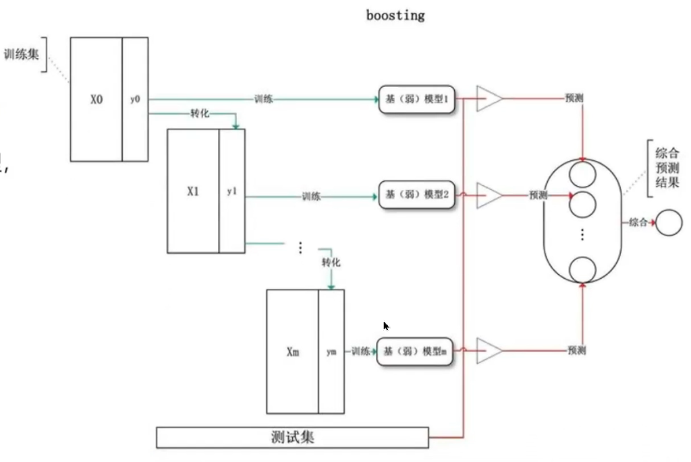
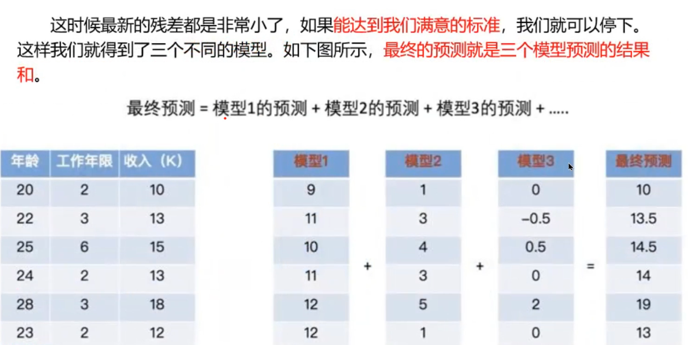
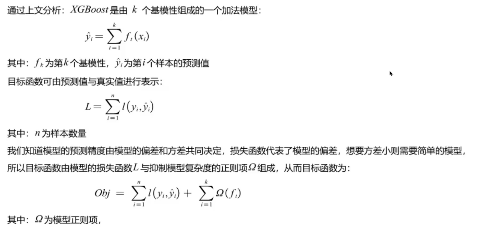
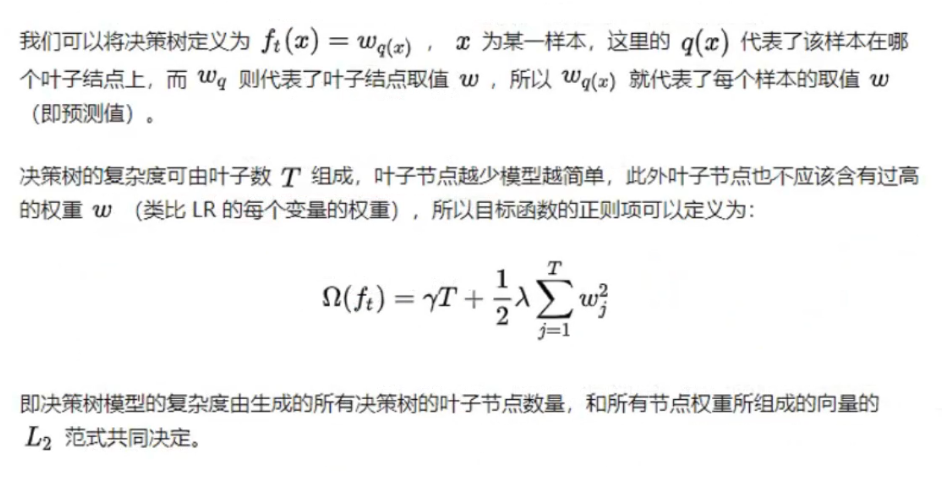
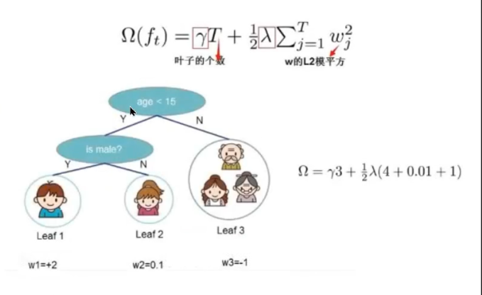
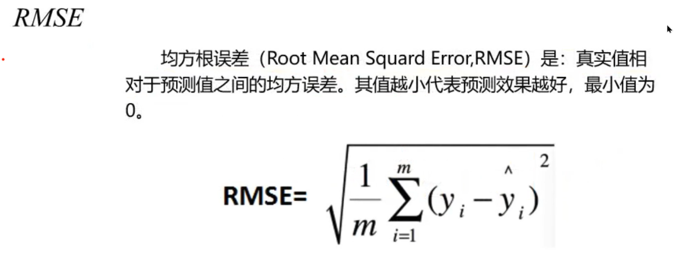
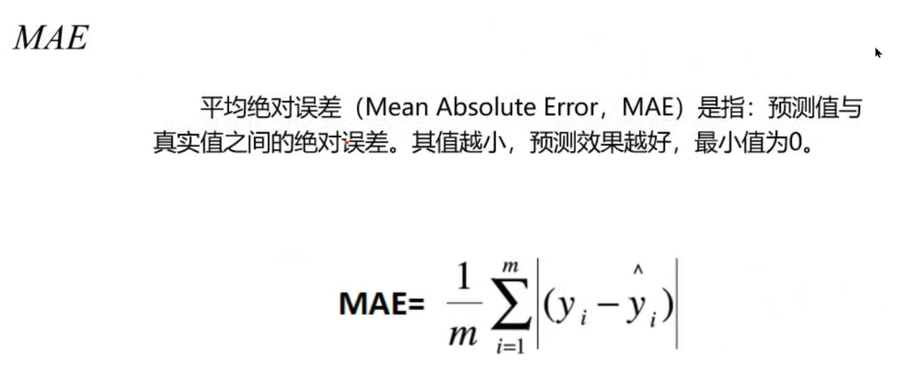

人工神经元 ANN


人工神经元，数学近似映射一般分为**拟合和分类**两部分，又称为**预测和聚类分析**。

数学近似映射，即将两组数据映射起来的问题。


建立和应用ANN的大致步骤


神经元的信息传递和处理是一种**电化学活动**，树突由于电化学作用接受外界的刺激；通过胞体内的活动体现为轴突电位，当轴突电位达到一定的值则形成神经脉冲或动作电位；再通过轴突末梢传递给其它的神经元，从控制论的观点来看；这一过程可以看作一个 **多输入单输出非线性 **系统的动态过程。


参数承担着拟合的过程，

参数被成为权重，

在我们选择某种算法的时候，我们就已经默认数据分布就符合那种关系了。

我们并不知道预先数据的输入和输出到底符合什么样的一个分布。

就用y和x建立一个权w俩表示它们之间的关系，仅仅假设它们之间是可以通过一个权来连接的。（理解权w是一个自动变化的？）


问题：激活函数为什么要是连续函数，它是怎么吧离散数据变连续的，为什么要求导？


### BP神经网络


BP神经网络上每一条线，都是一个权值。


### 构建和训练

有最大循环次数，

里期望目标误差的最小值。


网络训练好后用sim来仿真。


### XGBoost 构建预测模型

1 XGBoost基本原理

2 XGBoost时序建模

3 XGBoost时间序列预测实践

可参考如下链接：

> [XGBoost算法的相关知识_VariableX的博客-CSDN博客](https://blog.csdn.net/VariableX/article/details/106149612)

#### 介绍、发展历程

XGBoost是 **基于决策树的集成机器学习算法**，它以**梯度提升(Gradient Boost)**为框架。在非结构数据(图像、文本等的预测问题中，人工神经网络的表现要优于其他算法或框架。但在处理**中小型结构数据**或表格数据时，现在普遍认为基于决策树的算法是最好的。右图列出了近年来基于树的算法的演变过程:



#### 集成学习框架

常见的集成学习框架有三种：**Bagging， Boosting 和 Stacking** 三种集成学习框架 **在基学习器的产生和综合结果的方式** 上会有些区别。XGBoost是基于Boosting的算法模型，我们先来看看 **Boosting框架** 的学习方式。

> 训练集用于模型的训练，测试集用于模型的测试：



Boosting 训练过程为阶梯状，**基模型的训练是有顺序的**，每个基模型都会在 **前一个基模型学习的基础上** 进行学习，最终综合所有 **基模型的预测值** 产生最终的预测结果，用的比较多的综合方式为加权法（就是累加）。

#### 学习过程的通俗理解

每次都用 **相同的基模型**（相同的机器学习器），基于上一次模型预测的结果，去拟合上一次的残差，最终将所有预测都加起来。

如下图所示：



> 当第m个基学习器预测的残差，在容限范围之内的话就能结束训练过程了。

#### 目标函数

*这里拓展一下XGBoost的理论*



目标函数主要是一个关于 **预测值和真实值** 的函数 **l**（有MAE，MSE）


#### XGBoost 的正则项

正则项主要用来做抑制（增加差距，增大目标函数），一下部分只需了解原理也不够详细。





#### 评价指标

对预测结果做一个验证，通过评价指标函数：

##### MAPE - 平均绝对百分比误差


##### RMSE - 均方根误差



##### MAE - 平均绝对误差



### XGBoost 时序建模

用15个连续时间点上的数值，预测第16个数值。

#### 预测结果

由左边的表可见最靠近的时刻，对结果的影响最大。


#### 代码实践

##### 数据集文件

数据集放在同目录的`csv`文件中：

```csv
time,data
2018-1-1,4.7767
2018-1-2,4.9907
2018-1-3,4.942
2018-1-4,4.6895
2018-1-5,5.09
2018-1-6,4.6894
2018-1-7,4.6547
2018-1-8,4.8151
2018-1-9,5.0202
```

（共365条以逗号隔开，等同于excel表格）

##### python 导入模块

```python
import numpy as np
import pandas as pd
import matplotlib.pyplot as plt
from xgboost import XGBRegressor
from sklearn.metrics import mean_squared_error as mse
from sklearn.metrics import mean_absolute_error as mae
from sklearn.metrics import mean_absolute_percentage_error as mape
```

##### python 脚本

可通过`pandas` 的 `pd.read_csv` 函数读取返回一个数据集对象。

```python
#1导入数据
datasets = pd.read_csv('site_arima.csv')
dataset = datasets.iloc[:,1].values.reshape(-1,1)
```

`dataset` 获取的是第2列数据，`csv` 文件中的`time` 数据不作为预测的输入。

`reshape(-1,1)` 可忽略，`-1` 代表所有行。

```python
#2切片
step_size = 15  # time_step = 15
data_input = np.zeros((len(dataset) - step_size, step_size))
for i in range(len(dataset)-step_size):
    data_input[i, :] = dataset[i:step_size + i, 0]
data_label = dataset[step_size:, 0]
```

`data_input` 是一个二维数组（不是列表），可以像 **matlab** 里一样用`[行下标, 列下标]` 来访问。

>如果是原生的列表就会报错：
>
>TypeError: list indices must be integers or slices, not tuple
>
>所以numpy 二维数组、矩阵可以用2维的元组来访问。

```python
#3划分数据集
test_number = 10
##训练集
X_train = data_input[:-test_number]
Y_train = data_label[:-test_number]
##测试集
X_test = data_input[-test_number:]
Y_test = data_label[-test_number:]
```

`- test_number` 代表倒数第10个，python可以用负数表示倒数的序号。

```python
#4搭建预测模型
xgb = XGBRegressor(booster='gbtree',max_depth=40, learning_rate=0.2,reg_alpha=0.01, n_estimators=2000, gamma=0.1, min_child_weight=1)

xgb.fit(X_train,Y_train)

pre = xgb.predict(X_test)
```

**搭建，训练，预测**

`XGBRegressor` 代表回归模型，`booster='gbtree'` 是指基学习器的类型`'gbtree'`是集成学习框架的一种类型。

> 模型搭建的参数可参考：
>
> [XGBRegressor(booster='gbtree',max_depth=40, learning_rate=0.2,reg_alpha=0.01, n_estimators=2000, gamma=0.1, min_child_weight=1) - 搜索 (bing.com)](https://cn.bing.com/search?q=XGBRegressor(booster%3D'gbtree'%2Cmax_depth%3D40%2C+learning_rate%3D0.2%2Creg_alpha%3D0.01%2C+n_estimators%3D2000%2C+gamma%3D0.1%2C+min_child_weight%3D1)&form=QBLH&sp=-1&pq=&sc=0-0&qs=n&sk=&cvid=F73AC9ECDE974E1DBA325198850F5C01&ghsh=0&ghacc=0)
>
> [XGBRegressor 参数调优_csiao_Bing的博客-CSDN博客_xgbregressor](https://blog.csdn.net/csiao_Bing/article/details/84978725)
>
> [XGBoost 重要参数、方法、函数理解及调参思路（附例子）_VariableX的博客-CSDN博客_xgb.train参数](https://blog.csdn.net/VariableX/article/details/107238137)

然后用`X_train,Y_train`去训练`xgb`回归模型。

最后用`xgb.predict()`，和测试集 `X_test` 去预测了。

```python
#5指标重要性可视化
importance = xgb.feature_importances_
plt.figure(1)
plt.barh(y = range(importance.shape[0]),  #指定条形图y轴的刻度值
         width = importance,  #指定条形图x轴的数值
         tick_label =range(importance.shape[0]),  #指定条形图y轴的刻度标签
         color = 'orangered',  #指定条形图的填充色
         )
plt.title('Feature importances of XGBoost')
```

对输入的15个时间序列，每个序列值的`重要性程度`做一个可视化。

```python
#6计算评价指标
print(' MAE : ', mae(Y_test, pre))
print(' MAPE : ',mape(Y_test, pre))
print(' RMSE : ', np.sqrt(mse(Y_test, pre)))
```

通过`mae`，`mape`，`均方根误差` 去评价预测值和真实值的差距。

```python
#7结果可视化
plt.figure(2)
plt.plot(pre, color='red',label='predict')
plt.plot(Y_test, color='blue',label='true')
plt.title('Result visualization')
plt.legend()
plt.show()
```

这里输出第二张图标。

