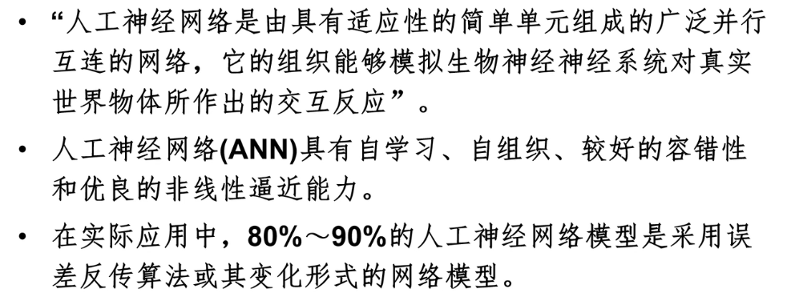
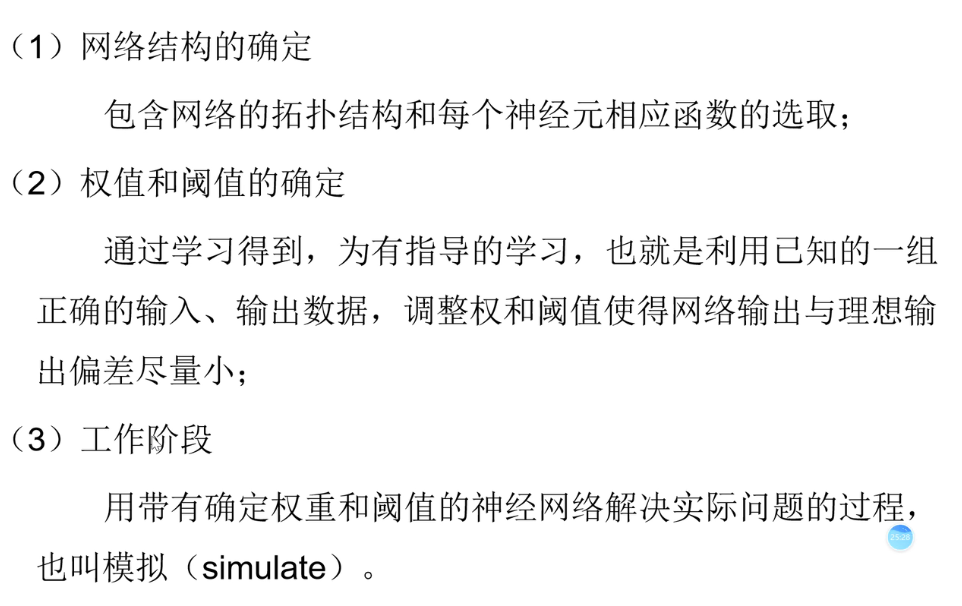
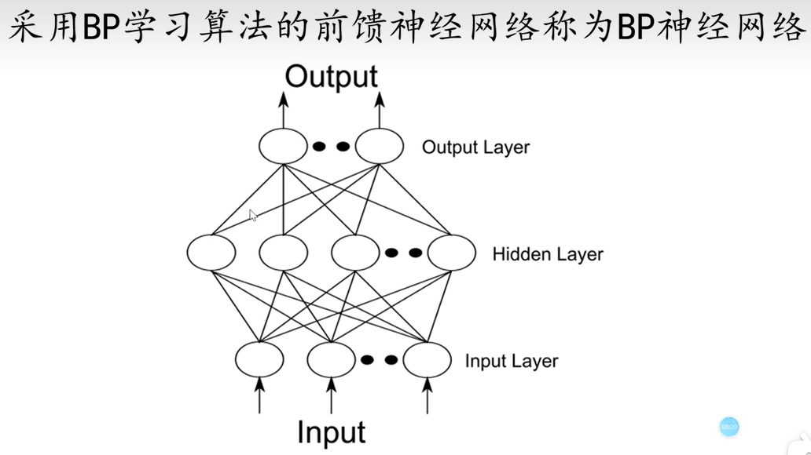

### 机器学习

从广义上来说，机器学习是一种能够 **赋予机器学习的能力**，以此让它完成 **直接编程** 无法完成的功能的方法。从实践的意义上来说，**机器学习是一种通过利用数据，训练出模型，然后使用模型预测的一种方法**。

> 机器学习属于人工智能的一个范畴，而人工神经网络是机器学习中的一个方法。

机器学习的方法：


#### 人工神经元 ANN



人工神经元，数学近似映射一般分为**拟合和分类**两部分，又称为**预测和聚类分析**。

（数学近似映射，即将两组数据映射起来的问题。）

#### 神经元的信息传递和处理

神经元的信息传递和处理是一种**电化学活动**，树突由于电化学作用接受外界的刺激；通过胞体内的活动体现为轴突电位，当轴突电位达到一定的值则形成神经脉冲或动作电位；再通过轴突末梢传递给其它的神经元，从控制论的观点来看；这一过程可以看作一个 **多输入单输出非线性 **系统的动态过程。


> 参数承担着拟合的过程。
>
>参数被成为权重。
>
>在我们选择某种算法的时候，我们就已经默认数据分布就符合那种关系了。
>
>我们并不知道预先数据的输入和输出到底符合什么样的一个分布。
>
>就用y和x建立一个权w俩表示它们之间的关系，仅仅假设它们之间是可以通过一个权来连接的。（理解权w是一个自动变化的？）

*问题：激活函数为什么要是连续函数，它是怎么让离散数据变连续的，为什么要求导？*


#### 建立和应用ANN的大致步骤




### BP神经网络



BP神经网络上每一条线，都是一个权值。

#### 单个神经元的结构


#### 激活函数

##### Sigmoid

值域0~1之间


##### tanh

是Signmoid函数的缩放，加平移。


##### ReLU


#### 预测模型的评价指标

##### R^2 - 拟合优度


##### RMSE - 均方根误差

##### MAE - 平均绝对误差

### 循环神经网络 RNN

深度学习是神经网络的一个分支，而RNN是深度学习的一个方法。

深度学习与神经网络的关系：**深度学习的概念源于人工神经网络的研究,但是并不完全等于传统神经网络。**

#### 基本原理

##### BPNN 的缺点

BPNN只能单独地处理一个个的输入，而序列输入的问题并不能较好的处理。如前一句话和后一句话是有关联的，我们需要将这些信息连接起来处理。

##### RNN 的结构

隐藏层某一个时刻的输入，等于上一时刻的输出，加输入层的输入。即S(t-1) + X(t)


有公式：O(t) = g( V * S(t) )

S(t) = f( U * X(t) + W * S(t-1) )

这里U和W是权重，f是激活函数。


#### 训练RNN

##### 损失函数


#### RNN预测

利用RNN进行时间序列预测

##### 张量转化

RNN的输入是三维的

此外模型搭建和BPNN不同

### XGBoost 构建预测模型

1 XGBoost基本原理

2 XGBoost时序建模

3 XGBoost时间序列预测实践

可参考如下链接：

> [XGBoost算法的相关知识_VariableX的博客-CSDN博客](https://blog.csdn.net/VariableX/article/details/106149612)

#### 介绍、发展历程

XGBoost是 **基于决策树的集成机器学习算法**，它以**梯度提升(Gradient Boost)**为框架。在非结构数据(图像、文本等的预测问题中，人工神经网络的表现要优于其他算法或框架。但在处理**中小型结构数据**或表格数据时，现在普遍认为基于决策树的算法是最好的。右图列出了近年来基于树的算法的演变过程:


#### 集成学习框架

常见的集成学习框架有三种：**Bagging， Boosting 和 Stacking** 三种集成学习框架 **在基学习器的产生和综合结果的方式** 上会有些区别。XGBoost是基于Boosting的算法模型，我们先来看看 **Boosting框架** 的学习方式。

> 训练集用于模型的训练，测试集用于模型的测试：


Boosting 训练过程为阶梯状，**基模型的训练是有顺序的**，每个基模型都会在 **前一个基模型学习的基础上** 进行学习，最终综合所有 **基模型的预测值** 产生最终的预测结果，用的比较多的综合方式为加权法（就是累加）。

#### 学习过程的通俗理解

每次都用 **相同的基模型**（相同的机器学习器），基于上一次模型预测的结果，去拟合上一次的残差，最终将所有预测都加起来。

如下图所示：


> 当第m个基学习器预测的残差，在容限范围之内的话就能结束训练过程了。

#### 目标函数

*这里拓展一下XGBoost的理论*


目标函数主要是一个关于 **预测值和真实值** 的函数 **l**（有MAE，MSE）


#### XGBoost 的正则项

正则项主要用来做抑制（增加差距，增大目标函数），一下部分只需了解原理也不够详细。


#### 评价指标

对预测结果做一个验证，通过评价指标函数：

##### MAPE - 平均绝对百分比误差


##### RMSE - 均方根误差


##### MAE - 平均绝对误差


### XGBoost 时序建模

用15个连续时间点上的数值，预测第16个数值。

#### 预测结果

由左边的表可见最靠近的时刻，对结果的影响最大。


#### 代码实践

##### 数据集文件

数据集放在同目录的`csv`文件中：

```csv
time,data
2018-1-1,4.7767
2018-1-2,4.9907
2018-1-3,4.942
2018-1-4,4.6895
2018-1-5,5.09
2018-1-6,4.6894
2018-1-7,4.6547
2018-1-8,4.8151
2018-1-9,5.0202
```

（共365条以逗号隔开，等同于excel表格）

##### python 导入模块

```python
import numpy as np
import pandas as pd
import matplotlib.pyplot as plt
from xgboost import XGBRegressor
from sklearn.metrics import mean_squared_error as mse
from sklearn.metrics import mean_absolute_error as mae
from sklearn.metrics import mean_absolute_percentage_error as mape
```

##### python 脚本

可通过`pandas` 的 `pd.read_csv` 函数读取返回一个数据集对象。

```python
#1导入数据
datasets = pd.read_csv('site_arima.csv')
dataset = datasets.iloc[:,1].values.reshape(-1,1)
```

`dataset` 获取的是第2列数据，`csv` 文件中的`time` 数据不作为预测的输入。

`reshape(-1,1)` 可忽略，`-1` 代表所有行。

```python
#2切片
step_size = 15  # time_step = 15
data_input = np.zeros((len(dataset) - step_size, step_size))
for i in range(len(dataset)-step_size):
    data_input[i, :] = dataset[i:step_size + i, 0]
data_label = dataset[step_size:, 0]
```

`data_input` 是一个二维数组（不是列表），可以像 **matlab** 里一样用`[行下标, 列下标]` 来访问。

>如果是原生的列表就会报错：
>
>TypeError: list indices must be integers or slices, not tuple
>
>所以numpy 二维数组、矩阵可以用2维的元组来访问。

```python
#3划分数据集
test_number = 10
##训练集
X_train = data_input[:-test_number]
Y_train = data_label[:-test_number]
##测试集
X_test = data_input[-test_number:]
Y_test = data_label[-test_number:]
```

`- test_number` 代表倒数第10个，python可以用负数表示倒数的序号。

```python
#4搭建预测模型
xgb = XGBRegressor(booster='gbtree',max_depth=40, learning_rate=0.2,reg_alpha=0.01, n_estimators=2000, gamma=0.1, min_child_weight=1)

xgb.fit(X_train,Y_train)

pre = xgb.predict(X_test)
```

**搭建，训练，预测**

`XGBRegressor` 代表回归模型，`booster='gbtree'` 是指基学习器的类型`'gbtree'`是集成学习框架的一种类型。

> 模型搭建的参数可参考：
>
> [XGBRegressor(booster='gbtree',max_depth=40, learning_rate=0.2,reg_alpha=0.01, n_estimators=2000, gamma=0.1, min_child_weight=1) - 搜索 (bing.com)](https://cn.bing.com/search?q=XGBRegressor(booster%3D'gbtree'%2Cmax_depth%3D40%2C+learning_rate%3D0.2%2Creg_alpha%3D0.01%2C+n_estimators%3D2000%2C+gamma%3D0.1%2C+min_child_weight%3D1)&form=QBLH&sp=-1&pq=&sc=0-0&qs=n&sk=&cvid=F73AC9ECDE974E1DBA325198850F5C01&ghsh=0&ghacc=0)
>
> [XGBRegressor 参数调优_csiao_Bing的博客-CSDN博客_xgbregressor](https://blog.csdn.net/csiao_Bing/article/details/84978725)
>
> [XGBoost 重要参数、方法、函数理解及调参思路（附例子）_VariableX的博客-CSDN博客_xgb.train参数](https://blog.csdn.net/VariableX/article/details/107238137)

然后用`X_train,Y_train`去训练`xgb`回归模型。

最后用`xgb.predict()`，和测试集 `X_test` 去预测了。

```python
#5指标重要性可视化
importance = xgb.feature_importances_
plt.figure(1)
plt.barh(y = range(importance.shape[0]),  #指定条形图y轴的刻度值
         width = importance,  #指定条形图x轴的数值
         tick_label =range(importance.shape[0]),  #指定条形图y轴的刻度标签
         color = 'orangered',  #指定条形图的填充色
         )
plt.title('Feature importances of XGBoost')
```

对输入的15个时间序列，每个序列值的`重要性程度`做一个可视化。

```python
#6计算评价指标
print(' MAE : ', mae(Y_test, pre))
print(' MAPE : ',mape(Y_test, pre))
print(' RMSE : ', np.sqrt(mse(Y_test, pre)))
```

通过`mae`，`mape`，`均方根误差` 去评价预测值和真实值的差距。

```python
#7结果可视化
plt.figure(2)
plt.plot(pre, color='red',label='predict')
plt.plot(Y_test, color='blue',label='true')
plt.title('Result visualization')
plt.legend()
plt.show()
```

这里输出第二张图标。


### ARIMA 模型

#### 背景

**时间序列分析** 是统计学科的一个重要分支。它主要是通过研究随着时间的推移事物发展变化过程中的规律，来进行事物未来发展情况的预测。在我们的日常生活中，世界人口数量，奶茶店每天的销售额，一年的降雨量分布，河水四季的涨落情况等都属于时间序列。时间序列的分析深入诸多行业。时间序列可以从以下几个方面分类：


##### AR (Auto Regression)


> *`P` 代表历史时刻的长度*
>
> *`平稳性` 是指数据可以随时间周期变化，但不周期地上升。*
> 
> **自回归模型** 首先需要确定一个阶数`p`，表示用几期的历史值来预测当前值。自回归模型有很多的限制：
> 
> - 自回归模型是用自身的数据进行预测
> - 时间序列数据必须具有 **平稳性**
> - 自回归只适用于预测与 **自身前期相关 **的现象（时间序列的自相关性）


##### MA (Moving Average)

当前时刻的值，是过去时刻白噪声的线性组合


##### ARMA模型


> 上式表明：（1）一个时间序列可以通过一个自回归移动平均模型来表示，即该序列可以由其自身的过去或滞后值以及随机扰动项来解释。（2）如果该序列是平稳的,即它的行为并不会随着时间的推移而变化，那么我们就可以通过该序列过去的行为来预测未来。


##### ARIMA模型

通过差分把非平稳序列转化为平稳序列，是统计学的一个基本方法。

将自回归模型（AR）、移动平均模型（MA）和差分法结合,我们就得到了差分自回归移动平均模型ARIMA (p、d、q)，,其中d是需要对数据进行差分的阶数。

###### 差分是怎么做的？


#### 建模步骤

##### ADF检验

先检验序列平稳，通过差分法将非平稳序列转化为平稳序列，再用ARMA去做进一步整理。


*这上面讲到太数学理论了*。

###### 怎么看ADF检验平稳序列？


一般而言，当第二个参数小于`0.05`可认为序列平稳（上面红线划出来了）。其中第二行 `8.190878710544816e-25` 已经远小于 `0.05`了。

> 参数d，代表差分阶数。
>
> 所以 **ARIMA** 模型参数是`pdq`

##### ACF 和 PACF

自相关函数，和偏自相关函数。

假设有`X(t), X(t-1), X(t-2), X(t-3), ...`


##### 理论估计


`pdq`参数缺点后，ARIMA模型就定阶了。

> python中使用ARIMA需要的模块、函数
>
> ```python
> import matplotlib.pyplot as plt
> import pandas as pd
> import statsmodels.api as sm
> from statsmodels.tsa.arima.model import ARIMA
> from statsmodels.tsa.stattools import adfuller as ADF
> ```

##### 参数估计

实际例子，

1. 先导入数据

   ```python
   dateparse = lambda dates: pd.datetime.strptime(dates, '%Y-%m-%d')
   df = pd.read_csv('site_arima.csv', parse_dates=['time'], 
                    index_col='time', date_parser=dateparse)
   seq_train = df['2018-1-1':'2018-12-23']
   seq_test = df['2018-12-24':'2018-12-31']
   ```

   

2. 平稳性检验

   首先检验原始序列的平稳性。如果原始序列不平稳，则进行差分，直到差分后数据变得平稳。

   > timeseries 是输入的时间序列，类型DataFrame有差分方法diff()
   > 
   > ```python
   > timeseries_diff1 = timeseries.diff(1)
   > timeseries_diff2 = timeseries_diff1.diff(1)
   > 
   > timeseries_diff1 = timeseries_diff1.fillna(0)
   > timeseries_diff2 = timeseries_diff2.fillna(0)
   > 
   > print('timeseries_adf : ', ADF(timeseries['data'].tolist()))
   > print('timeseries_diff1_adf : ', ADF(timeseries_diff1['data'].tolist()))
   > print('timeseries_diff2_adf : ', ADF(timeseries_diff2['data'].tolist()))
   > ```

   注：每差分一次序列长度会少1。检验结果输出绘图如下：

   ```python
   plt.figure(figsize=(12, 8))
   plt.plot(timeseries, label='Original', color='blue')
   plt.plot(timeseries_diff1, label='Diff1', color='red')
   plt.plot(timeseries_diff2, label='Diff2', color='purple')
   plt.legend(loc='best')
   plt.show()
   ```

   

3. `确定 p q` 阶数

   通常而言，可以通过自相关函数（ACF）和偏自相关函数（PACF）确定`p`和`q`。方法大致如下：

   

   

   严格来看，ACF和PACF显示存在一定程度的拖尾和振荡。从而并不能直观的看出p和q的值。

   > ACF和PACF函数，以及绘制结果。
   >
   > ```python
   > def auto_correlation(timeseries, lags):
   > fig = plt.figure(figsize=(12, 8))
   > ax1 = fig.add_subplot(211)
   > ax2 = fig.add_subplot(212)
   > sm.graphics.tsa.plot_acf(timeseries, lags=lags, ax=ax1)
   > sm.graphics.tsa.plot_pacf(timeseries, lags=lags, ax=ax2)
   > plt.show()
   > ```
   >
   > 传入差分后平稳的时间序列：
   >
   > ```python
   > auto_correlation(seq_train_diff, 20)
   > ```
   > 
   
   虽然ACF和PACF为我们提供了 **选择模型参数的参考依据**，但是一般实际情况中，我们总会需要通过模型训练效果确定最终采用的参数值。
   
   ARMA模型中，我们通常采用 **AIC法则**（赤池信息准则，AIC=2k-2ln(L)， k为模型参数个数，n为样本数量，L为似然函数） 。AIC鼓励数据拟合的有良性但是尽量避免出现过拟合的情况。
   
   ```python
   # 通过aic准则，估计p,q
   trend_evaluate = sm.tsa.arma_order_select_ic(seq_train_diff, ic=['aic'], trend='n', max_ar=4, max_ma=4)
   print('calculate AIC', trend_evaluate.aic_min_order)
   ```
   
   输出 `calculate AIC (2, 4)` 即 `p,q = (2, 4)`
   
   


##### 构建预测模型

完成p.d.q参数估计以后，将训练集数据以及估计完成的参数输入ARIMA模型训练，最后输出实例化的模型：


> 实际成功运行的代码如下：*（直播课件中的代码是 2020年的，ARIMA的一些模块和函数已经不支持了。）*
>
> ```python
> # 序列模型训练
> def arima_model(timeseries, order):
>  model = ARIMA(timeseries, order=order)
>  return model.fit()
> 
> model = arima_model(seq_train, (2, 1, 4))
> ```
>
> 注：seq_train 是原始序列不用差分，已经传入order=(p, d, q)参数在模型示例化时会处理。

##### 预测未来8天

通过训练完成的模型对未来8天进行预测，并可视化预测结果。


这张图说明 ARIMA 模型还是适合短期预测，长期效果不行。

> 实际成功运行的代码如下：
>
> ```python
> # 作为期8天的预测
> pred_day = 8
> y_forecasted = model.forecast(steps=pred_day, alpha=0.01)
> y_truth = seq_test['2018-12-24':'2018-12-31']
> 
> plt.figure(2)
> plt.plot(y_forecasted, color='red', label='predict_seq')
> plt.plot(y_truth, color='blue', label='seq_test')
> plt.legend()
> plt.show()
> ```
>
> 即 y_forecasted 不要试图切出一列，直接输出否则实际切出的是一行？
>
> 

