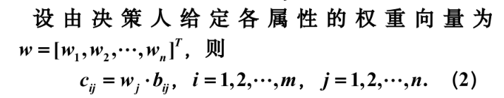

## TOPSIS法

评价方法大体上可分为两类，其主要区别在确定权重的方法上。

**TOPSIS** 是客观赋值的，用以综合评价。

### 介绍

介绍多属性决策问题的理想解法：

理想解法亦称为TOPSIS 法，是一种有效的多指标评价方法。这种方法通过构造评价问题的正理想解和负理想解，即 **各指标的最优解和最劣解**，通过计算每个方案到 **理想方案的相对贴近度** ，即靠近 **正理想解** 和远离 **负理想解** 的程度，来对方案进行排序，从而选出最优方案。

### 算法步骤

#### 规范化决策矩阵

第一步，数据预处理，又称属性值的规范化。

**属性值具有多种类型**，包括效益型、成本型和区间型等。这三种属性，效益型属性越大越好，成本型属性越小越好，区间型属性是在某个区间最佳。

所以，**对属性值的规范化** 的作用：

1. 属性值类型（上述的三种）预处理，来统一比较。
2. 非量纲化（解决属性单位不同的 **量纲效益**）
3. 归一化

常用属性规范化方法：

（1）线性变换（与最优、最差的之比）

（2）标准0-1变换（最优、最差为1或0）

（3）区间属性的变换（非效益、成本型的属性——有一个区间）

**注：以上不一定都要用到。**


（5）标准化处理

在实际问题中，不同变量的测量单位往往是不一样的。为了消除变量的量纲效应，使每个变量都具有同等的表现力，数据分析中常对数据进行标准化处理，即：

其中aj是均值，sj是标准差。（都是某一列，同一属性，不同方案的数据的统计）

#### 加权规范矩阵

不是矩阵相乘，是每个元素都乘以对应的属性权重。



#### 正、负理想解的确定

同一属性，不同方案中选择最大和最小。

#### 各方案到理想解的距离

因为之前已经向量规范化了，因此能计算它们与某种虚拟方案的欧几里得距离。


#### 各方案排队指标

#### 各方案优劣排序

### 代码

```matlab
a=[0.1 5 5000 4.7
    0.2 6 6000 5.6
    0.4 7 7000 6.7
    0.9 10 10000 2.3
    1.2 2  400   1.8];
    
[m,n]=size(a);

x2=@(qujian,lb,ub,x)(1-(qujian(1)-x)./(qujian(1)-lb)).*(x>=lb&x<qujian(1))+...
    (x>=qujian(1)&x<=qujian(2))+(1-(x-qujian(2))./(ub-qujian(2))).*...
    (x>qujian(2)&x<=ub);
    
qujian=[5,6];lb=2;ub=12;

a(:,2)=x2(qujian,lb,ub,a(:,2));%对属性2进行变换

for j=1:n
    b(:,j)=a(:,j)/norm(a(:,j));%向量规范化
end
    
w=[0.2 0.3 0.4 0.1];
c=b.*repmat(w,m,1);%求加权矩阵

cstar=max(c);%求正理想解
cstar(4)=min(c(:,4));%属性4为成本型
   
c0=min(c);%求负理想解
c0(4)=max(c(:,4));%属性4为成本型的

for i=1:m
    sstar(i)=norm(c(i,:)-cstar);%求到正理想解的距离
    s0(i)=norm(c(i,:)-c0);%求到负理想解的距离
end

f=s0./(sstar+s0);
[sf,ind]=sort(f,'descend')  %求排序结果
```

