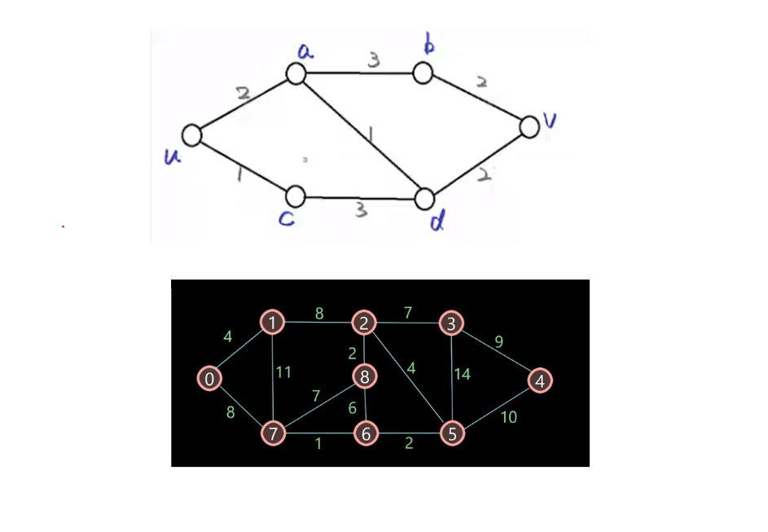
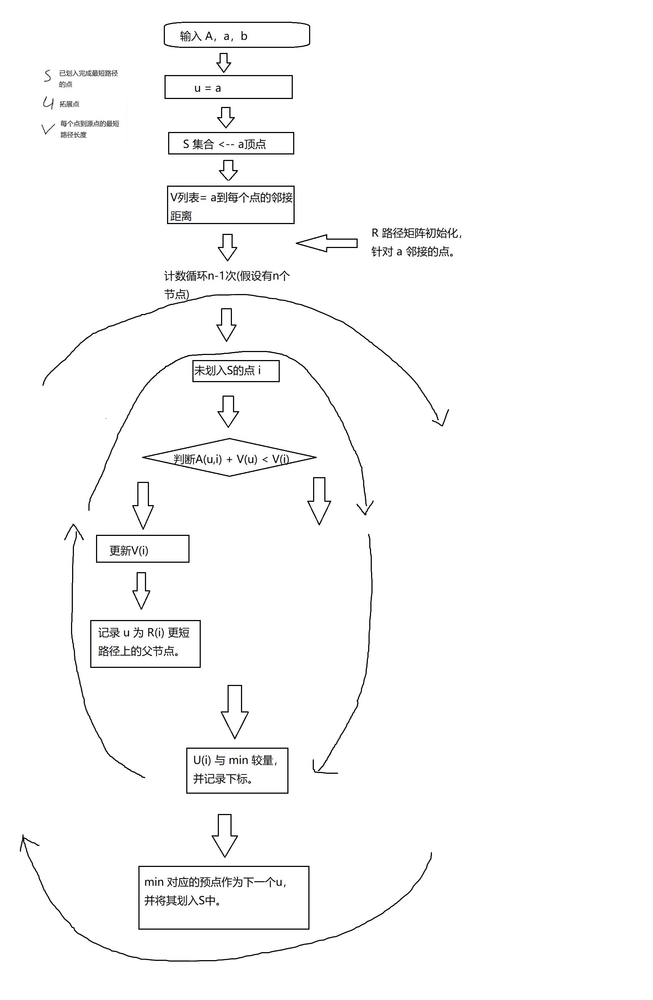
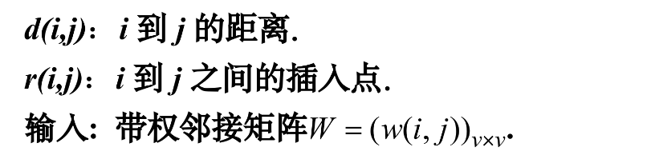

第二张图，用迪杰斯特拉算法求顶点0-->4的最短距离，答案是21

### dijkstra算法

#### 代码部分

文件：dijkstra.m

函数调用：[V,R] = dijkstra(A, a)

A：邻接矩阵（n * n）

a：源点

V：距离向量（1 * n）

R：路径向量（1 * n）

```matlab
function [V,R] = dijkstra(A, a) % A邻接矩阵，从a到b
[m,n] = size(A);
if m~=n
    return;
end

V = A(a, :); %与源点a的最短距离，初始=邻接距离
R = zeros(1, n); %记录每个顶点的父顶点，源点=0
R(find(R < Inf)) = a; %初始设置父节点
R(a) = 0; %源点无父节点
S = zeros(1, n); %已划入的点用1表示，否则0
u = a; %拓展点
S(a) = 1; 


for times = 1:n-1 %n-1次计数循环
    min = Inf;
    ind = 0;
    for i = find(S ~= 1) %未划入的点遍历，下标即点
        if A(u,i) + V(u) < V(i)
            V(i) = A(u,i) + V(u);
            R(i) = u; %更新父结点
        end
        if V(i) < min %刷新最小值，注意要与第一个if独立！
            min = V(i);
            ind = i;
        end
    end

    if ind == 0
        disp('图中存在源点无法到达的点！');
        return;
    end

    S(ind) = 1;
    u = ind;
end

end
```


文件：path2matrix.m

函数调用：M = path2matrix(R) 

R：路径向量（1 * n）

M：邻接矩阵（n * n）

```matl
function [M] = path2matrix(R) % R是单源最短路径构造树
n = length(R);
M = zeros(n) + Inf;
M(find(diag(diag(M)))) = 0;
% M邻接矩阵初始化完成。
M = sub(R,find(R == 0),M);
end


function [M] = sub(R,u,M)
chi = find(R == u);
M(u, chi) = 1;
for c = chi
    M = sub(R,c,M);
end
end
```


#### 流程图

针对 dijkstra 算法，以及算法中路径向量的生成。



**注意，路径向量要先初始化，并在每次更新V(i)——i 找到了能使距离更短的u时，也更新R(i)，让 u 作为 i 的父节点。**


### floyd 算法

#### 代码部分

文件：flody.m 

函数调用：[D,R] = flody(A)

A：邻接矩阵（n * n）

D：距离矩阵（n * n）

R：路径矩阵（n * n）

```matla
function [D,R] = flody(A)
%检查A矩阵是对角线都为0，没有负值存在的邻接矩阵
[m,n] = size(A);
if m ~= n
    return
end

D = A;
v = n; %邻接矩阵的阶数==顶点数
R = repmat(1:n, m, 1); %初始路径矩阵
for k = 1:v
    for i = 1:m
        for j = 1:n
            if i ~= j && and(i~=k,j~=k)
                if D(i,k) + D(k,j) < D(i,j)
                    D(i,j) = D(i,k) + D(k,j);
                    R(i,j) = k;
                end
            end
        end
    end
    %更新了矩阵D上的每一个元素
end
```


文件：route.m

函数调用：l = route(R, i, j)

R：路径矩阵（n * n）

i：出发顶点

j：到达顶点

l：路径的行向量（包括i，j 顶点）

```matl
function l = route(R, i, j)
l = [i, sub(R,i,j)]; %加入起点
end

function list = sub(R, a, b) %a不写入，b写入，返回路径顶点序列
if R(a,b) == b
    list = b;
    return;
end
e = R(a,b);
list = [sub(R, a, e), sub(R, e, b)];
end
```


#### 流程描述

floyd 算法实现，流程图，文字描述：

> 参考PPT（图论模型基础入门与实践.pptx）第37张



1. 用邻接矩阵初始距离矩阵D。
2. 迭代v次：
   1. 取顶点集V中的k（k是v个顶点中的一个）作为新的中转顶点
   2. 遍历距离矩阵D上的每一个元素：
      1. 元素d(i,j) 比较d(i,k)+d(k,j)是否小于d(i,j)
      2. 若小于则更新d(i,j)，并将k赋值到路径矩阵的R(i,j)上来记录k是i--》j最短路经上的某个中转点。
3. 输出D矩阵作为所有顶点的，任意两点间的最短距离d(i,j)。
4. 解析R上的r(i,j) 对应的i出发到达j点的最短路径（由点组成的序列）
   1. 初始将i 加入列表
      1. 进入函数，比较r(a,b)上记录的顶点是否==b
      2. 若是，则将b加入列表。
      3. 若不是，则令r(a,b)上的顶点为e。
         1. 先调用r(a,e)对应的函数，让a之后一直到e的顶点加入列表。
         2. 再调用r(e,b)对应的函数，让e之后一直到b的顶点加入列表。
      4. 函数返回。
   2. 输出列表。


#### 路径思路

- 用路径矩阵查找的原理分析：


### 参考

关于`gplot(A,XY)` 的绘图函数：

[知道邻接矩阵怎么用MATLAB绘图 – MATLAB中文论坛 (ilovematlab.cn)](https://www.ilovematlab.cn/thread-104663-1-1.html)

[绘制邻接矩阵中的节点和边 - MATLAB gplot - MathWorks 中国](https://ww2.mathworks.cn/help/matlab/ref/gplot.html)


矩阵变化处理的：

[ MATLAB对于矩阵对角线置零、对角线置inf或NaN、对角线置任意数值的方法讨论_weixin_33724570的博客-CSDN博客](https://blog.csdn.net/weixin_33724570/article/details/88828343)