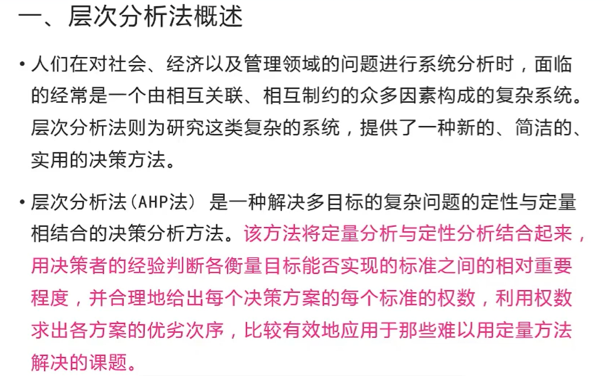
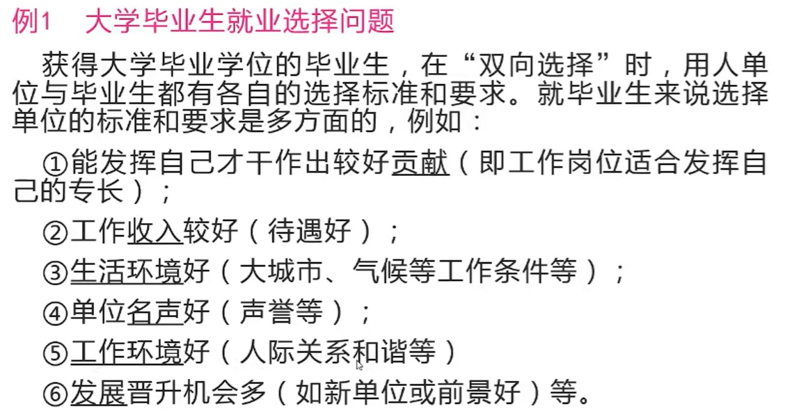
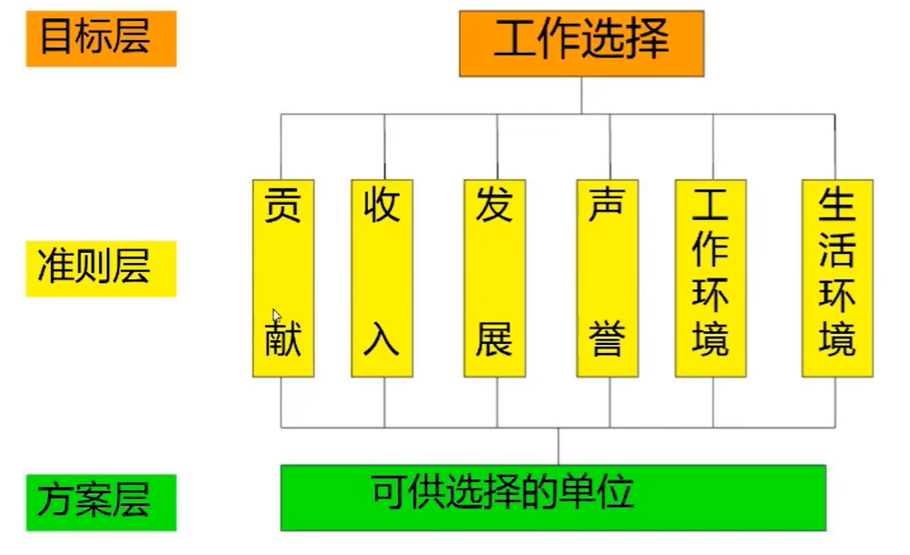
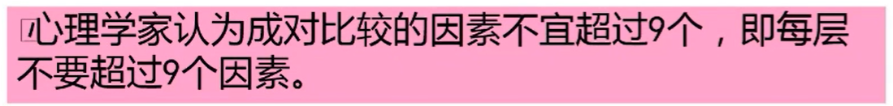
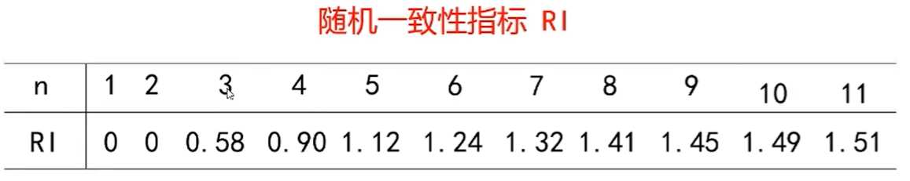
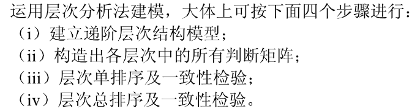
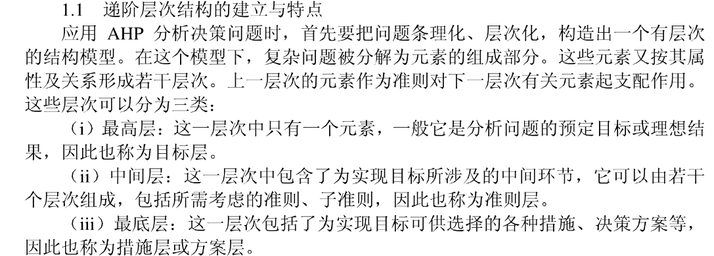
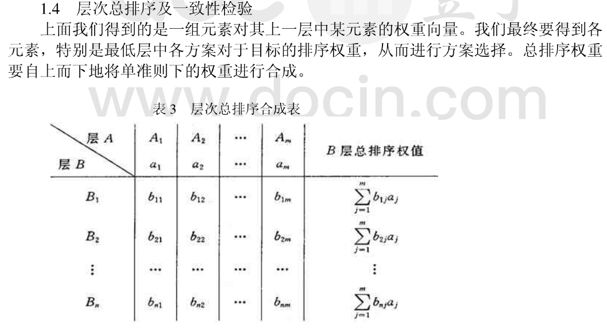

## 层次分析法

决策是指在面临多种方案时需要依据一定的标准选择某一种方案。日常生活中有许多决策问题。

### 层次分析法（AHP）概述

- 最优方案的选取
- 评价类问题
- 指标体系的优选

*方案层，是各个具体方案的实例，每个方案都应该是完整的（即有着准则层列出的各个指标）*

### 构造判断(成对比较) 矩阵

在确定各层次各因素之间的权重时，如果只是定性的结果，则 常常不容易被别人接受，因而Santy等人提出：一致矩阵法，即：

1. 不把所有因素放在一起比较，而是两两相互比较
2. 对此时采用相对尺度，以尽可能减少性质不同的诸因素相互比 较的困难，以提高准确度。
判断矩阵是表示本层所有因素针对上一层某一个因素的相对重要性的 比较。判断矩阵的元素 $\mathrm{a}_{\mathrm{ij}}$ 用Santy的1一9标度方法给出。

单排序的一致性检验，和全排序的一致性检验。

问题：什么是特征向量？（特征值法）

一致性检验：利用一致性指标和**一致性比率<0.1**

为衡量CI的大小，引入随机一致性指标 $\mathrm{RI}$ 。

最后，通过了一致性检验，说一下结论。

#### 参考

> [评价类模型——层次分析法，一致性检验 - jingsupo - 博客园 (cnblogs.com)](https://www.cnblogs.com/jingsupo/p/12391869.html)
>
> 
>
> 
>
> 
>
> **有了判断矩阵评价每个属性的相对标度，还要有如下定义的一致矩阵：**
>
> 
>
> **补充知识：矩阵的特征值，Aa=ca**，A是矩阵（n * n），a是特征向量(1 * n)，那么c就是特征值（有很多个）。

### 实际应用

评价指标就是模型？可能

所有要从给出的属性中筛选，作为指标。

其他的方法：

- 灰色？？法
- 模糊综合评价法
- ……

### 资料-步骤

### 层次单排序

判断矩阵 $A$ 对应于最大特征值 $\lambda_{\text {max }}$ 的特征向量 $W$, 经归一化后即为**同一层次相应因素**对于上一层次某因素**相对重要性的排序权值**, 这一过程称为层次单排序。

上述构造成对比较判断矩阵的办法虽能减少其它因素的干扰, 较客观地反映出一对因子影响力的差别。但综合全部比较结果时，其中难免包含一定程度的非一致性。 如果比较结果是前后完全一致的, 则矩阵 $A$ 的元素还应当满足:**一致矩阵**

### 层次总排序

起因：层次单排序已具有较为满意的一致性。但当综合考察时, 各层次的非一致性仍有可能积累起来, 引起最终分析结果较严重的非一致性。

