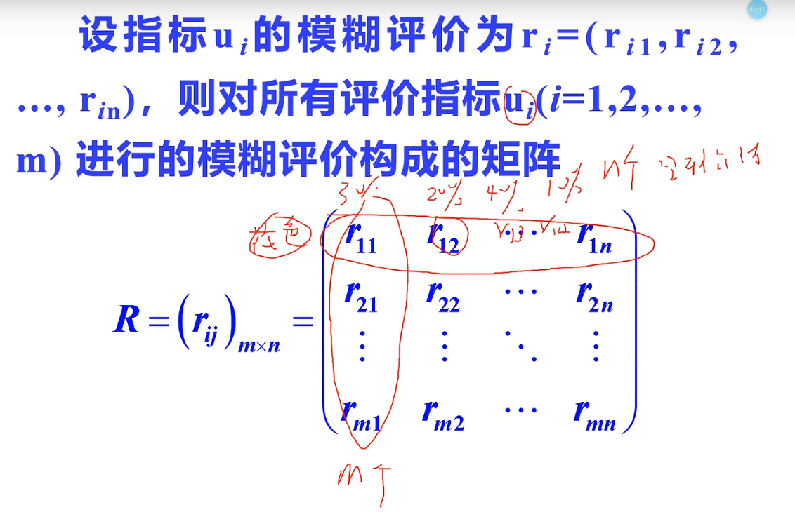
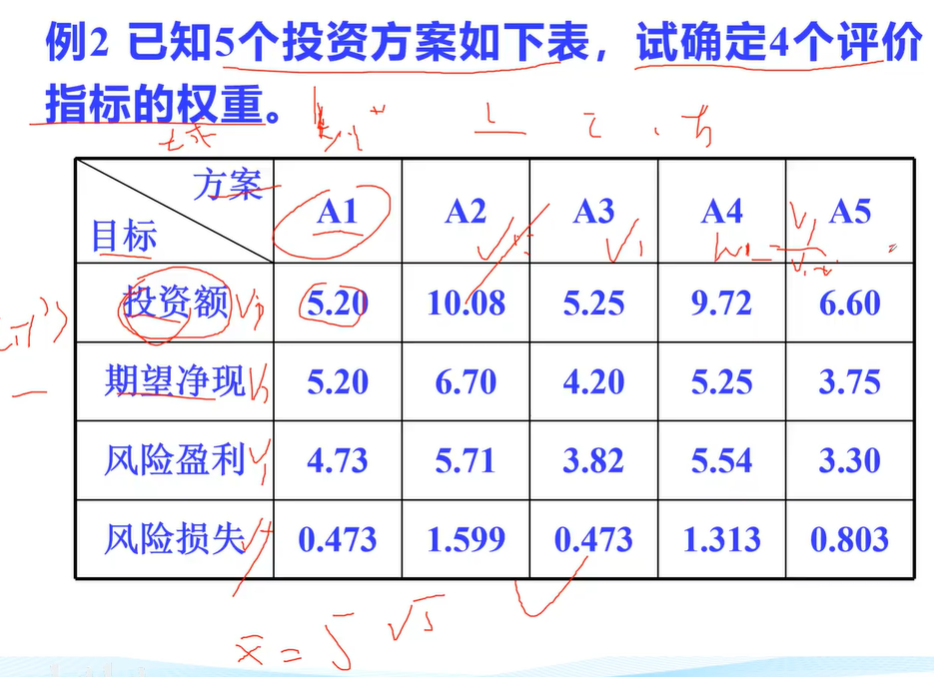
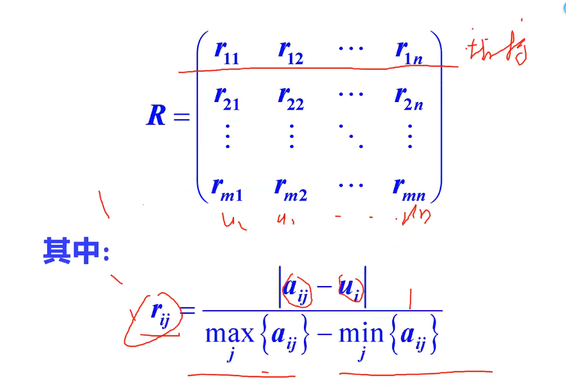

## 模糊综合评价

需要指出的是,模糊不确定不同于随机不确定。随机不确定是因果律破损造成的不确定,而模糊不确定是由于排中律破损造成的不确定。

- 隶属度
- 隶属函数

### 模糊集

是很多个隶属度，但都是同一个隶属函数来评价

例如，一个班级的隶属度集合， **好学生集合**

### 模糊集的运算

稽核运算==》隶属度运算

### 隶属度函数的确定

由模糊集的概念可知,模糊数学的基本思想是隶属度,所以应用模糊数学方法建立数学模型的关键是建立符合实际的隶属函数。然而,如何确定一个模糊集的隶属函数至今还是尚未完全解决的问题。

- 偏小型
- 偏大型
- 中间型

## 评价问题

评价是人类社会中经常性的、极为重要的认识活动。对一个事物的评价通常要涉及多个因素或多个指标,评价是在多因素相互作用下的一种综合评判。

### 综合评价方法

综合评价的方法众多,常用的有**灰色评价法、层次分析法、模糊综合评价法、数据包络分析法、人工神经网络评价法、理想解法等**。有时,还可将两种评价方法集成为组合评价方法。

评价方法不同，结论不同。

## 继续

基本思想：以模糊数学为基础,应用模糊关系合成原理,将一些边界不清、不易定量的因素定量化,从多个因素对被评价事物隶属等级状况进行综合评价。

-  模糊评价矩阵
- 评价对象因素的权向量

其中，权向量的获取可以通过层次分析法获得（但一般也不用）

如果，模糊评价矩阵是调查、对比出来的话（就直接有了），就有了层次分析的解法，否则在计算上不同。

### 模糊评价矩阵

每一行就是一项指标。

每一列代表 **很好、好、一般、……**

一个矩阵是对***某一具体物体***，在各项指标上的评价。

#### 隶属度的确定

模糊评价矩阵上的某一元素`r[i,j]`就是一个隶属度，是该物体在一项指标上（行）对 **一种评价标语** （列）的隶属度。

确定方法：

- 频率法（上图中多少人%认同就是），即市场调查法、调查问卷法

### 指标权重的确定

确定权重通常有主观和客观两类方法。主观法的代表是层次分析法。客观法是根据各指标间的联系,利用数学方法计算出各指标的权重,如质量分数法、变异系数法等。

#### 变异系数法

v1~v2就是各项指标的变异系数，它在所有变异系数之后上的比例，即可作为权重。

**变异系数法，基于哪一项指标区分度最强，但不能代表哪一项指标更重要。**

## R的确定

**大R矩阵** 的确定：

其中原矩阵的每一列是一项指标，每一行是一个方案，**矩阵代表各个方案的每一项指标上的数据**