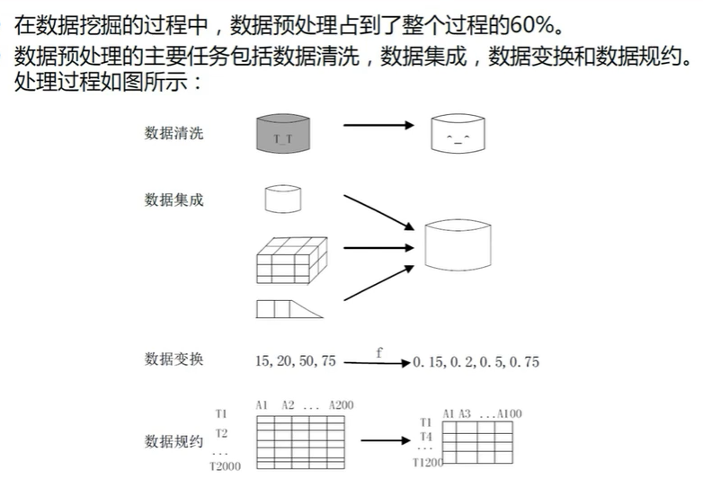
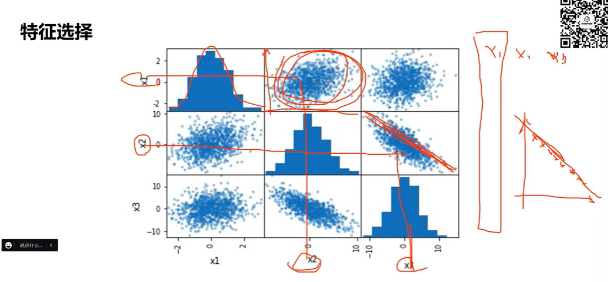
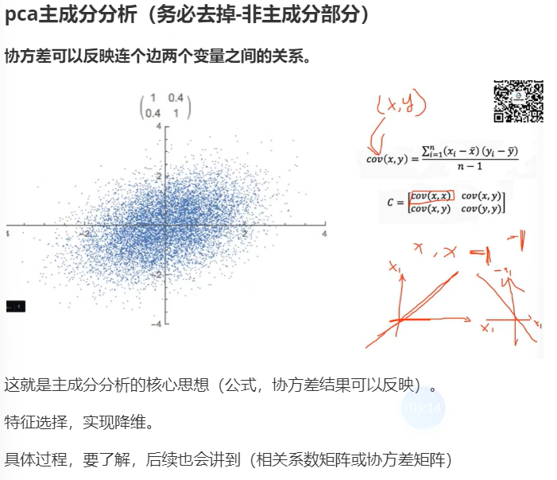

### 数据处理

数据在表格中结构化，对异常值的筛选剔出，即数据的**特征工程**

#### 数据存在的问题

现实世界中的数据大体上是不完整、不一致的脏数据，偏离了真正的规律。

1. 数据单位不一致
2. 噪声数据——（明显）偏离正常值
3. 缺失值

#### 数据清洗、集成、变换、规约

变换是为了单为一致，或让数据都服从**正态分布**，为了之后的处理。

*利用指数函数，对数函数，将偏态数据变换为接近正态分布的数据*

数据归一化，将数据按比例落入一个特定的区域。（减少数量级上的差异）一般将属性值映射到[-1,1] 或 [0,1]

##### 处理缺失值

删除记录、数据插补、不处理

其中数据插补：均值/中位数/众数插值，使用固定值、最近临插补（有次序关系、各属性的欧几里得距离），回归方法（需要机器学习，运算成本高），插值发（拉格朗日插值、牛顿插值）

##### 异常值处理

困难之处在于发现异常值，而不是将异常值替换成缺失值。

##### 离群点寻找

空间距离法（圆心法……）

d和p分别是用于判定，某一个样本是否为离群点的，距离阈值和非邻点（距离过大触及了d）的阈值。

**根据d=4,p=3，上述中的S1、S4、S6是离群点**

#### 特征工程

特征选取：过滤法、包装法、嵌入法。（在国赛中不是严格，只在题目给的样本数据的维度很大时、或很特殊时考虑）

##### 主成分分析PCA

压缩有关联的变量（变量即一列属性）

上图中，可以看到一个变量和另一个变量的相关程度。

类似的方法，来构造相关系数矩阵。

