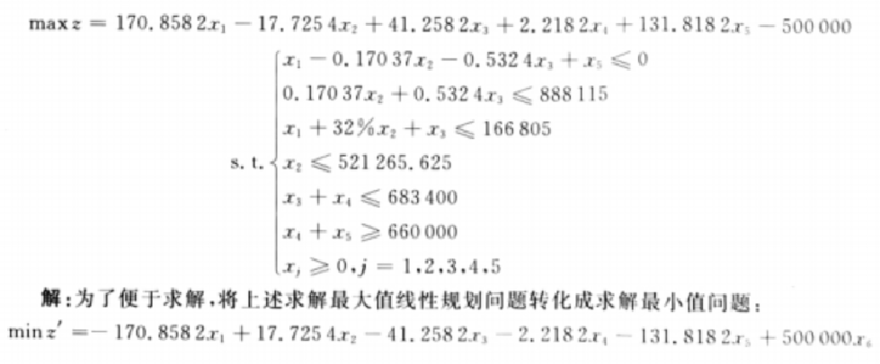
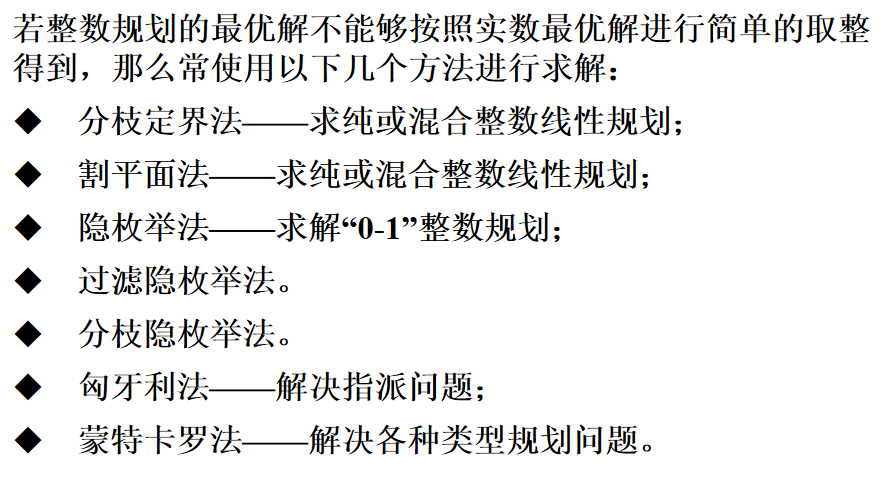

线性规划问题

要有：目标函数、决策变量、约束条件

目标函数及约束条件均为线性函数，故被称为线性规划问题。线性规划问题是在一组线性约束条件的限制下，求一线性目标函数最大或最小的问题。

像人是整数形式的，纯整数限定。

实数可行解不能四舍五入变成整数可行解，会不满足约束条件。同时如果可以，会有最优解变差的情况。

运输问题和指派问题。

松弛变量和剩余变量。

松弛问题无可行解，整数规划也无可行解。

> 线性规划一个lingprog就解决了！

### 线性规划

最终要解决优化问题！

#### 满足条件

线性规划问题要有：目标函数、决策变量、约束条件

目标函数及约束条件均为线性函数，故被称为线性规划问题。线性规划问题是在一组线性约束条件的限制下，求一线性目标函数最大或最小的问题。

可行解：满足约束条件的解

可行集：全体可行解

#### 标准形式

其中x0是初始值，有时会有。OPTIONS是控制变量。

根据经验：min或max后面的是目标函数，s.t.括起来的是约束条件。

#### 例题 1、2

当目标函数中出现常数时，通过新添加一个变量变成标准形式：

于此同时增加约束条件：x6=1（等式约束为1）

> 一定要注意标准形式，再代入函数

---

变量加了绝对值，而不再线性（函数图像上折了）

### 整数规划

在实际生活中，整数的情况出现地更多。

一般情况下整数规划指的是 **整数线性规划**。即利用线性规划时，将其中的变量限制为整数。

- 纯整数规划：将所有变量限制为整数的规划。
- 混合整数规划：将部分变量限制为整数的规划。

#### 求解法

> 目前还没有有效的方法求解整数规划

隔平面、分支定界、匈牙利法……

### 0-1规划

#### 例题 3

当约束条件相互排斥时：

引入0-1变量（或者更多“开关变量”）

令y=0（船运），y=1（车运），再设足够大的M让某个约束条件一定满足：

**s.t.**

### 指派形式

> 整数规划的应用

标准指派问题一般提法是：拟分派人A1,A2,......,An去完成n项工作B1,B2,......,Bn，要求每项工作需且仅需一个人去完成，每个人需完成且仅需完成一项工作。问题就是，已知 Ai 完成工作 Bj 的时间或费用等，成本型指标值为cij，则应如何指派才能使总的工作效率最高？

#### 指派模型

标准性指派问题的模型

#### 非标准指派

在实际应用中，常会遇到各种非标准形式的指派问题—广义指派问题。通常的处理方法是先将它们转化为标准形式

- 最大化指派问题；
- 人数与任务数不等；
- 一个人可完成多个任务；
- 某些任务限定不能让某个人完成。

##### 方法

---

> 人数与任务数不等：人少任务多，添加效率为0的“假人”；人多任务少，添加被任何人完成效率都为0的“假任务”
> 一个人可完成多个任务：添加“分身”，看作相同的几个人，完成同一任务的效率相等
> 某些任务限定不能让某个人完成，将相应的效率值（成本型）取成足够大的数即可。

### MATLAB整数规划

参数只比线性规划多一个`intcon`（指定哪个，哪些是整数，可以来解混合整数规划）

#### 指派问题

指派的变量一般是整数（0-1），只需用 intlinprog(f, intcon, a, b, aeq, beq, lb, ub)

*约束的公式在上面。*

0-1规划只需增加上界为1，下界为0的约束。

**指派问题首先要找到人和任务，一般标准情况的人和任务一一对应。**

### 其他规划

非线性、多目标规划