## 聚类分析

### 定义和介绍

聚类是将数据集划分为若干组（class）或类（cluster）。

相似或不相似是基于**数据描述属性**的取值来确定的，通常利用各数据对象间的距离来进行表示。

聚类分析适合探讨 **样本间的相互关联关系** ，从而对一个样本结构做一个初步的**评价**。

#### 示例

二维空间点的聚类分析

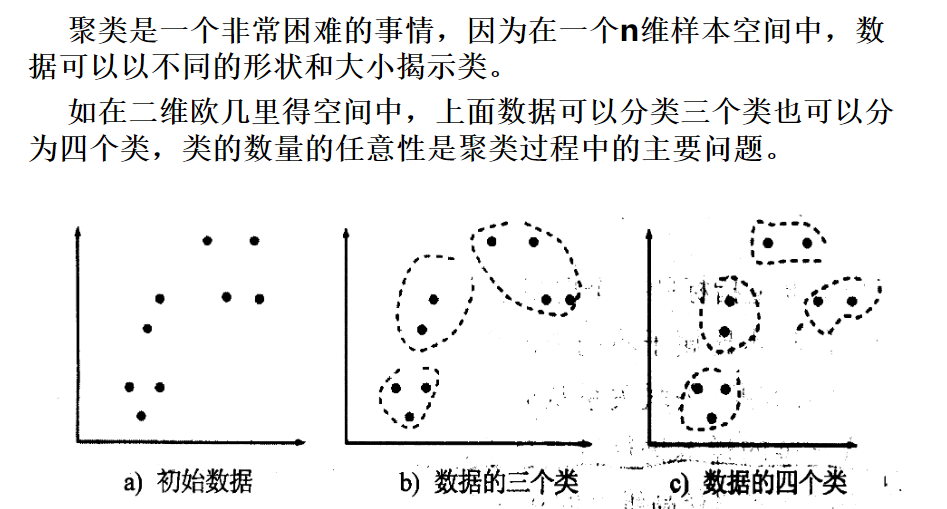

#### 好的结果

一个好的聚类方法将产生以下的 **高聚类**：

1. 最大化类内的相似性
2. 最小化类间的相似性

同时一个好的聚类方法，可以产生些或所有隐含模式的能力。

##### 度量

> 聚类结果的质量依靠所 **使用度量** 的相似性和它的执行

即样品间（单个之间，每个样品有多个属性）的 **相似度量 ** ，以及变量间的 **相似度量** 。

变量是指样品的某一属性。

#### Q型和R型

聚类分析有两种：一种是对**样品的分类**，称为Q型，另一种是对**变量（指标）的分类**，称为R型。

指标即样品属性。

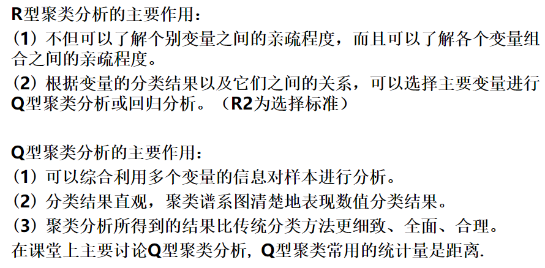

### 1、样品间

设有n个样品的p元观测数据： 

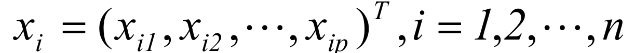

样本可以看作p元空间上的一个点，一共有n个这样的点。两个之间的**距离d ** 满足条件：

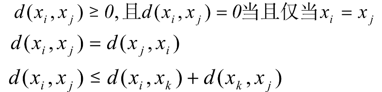

#### 各种实用的距离

图片中加粗的部分，是matlab代码（**pdist** 返回行向量）

x[i,k] 和 x[j,k] 是两个样本i, j 的各项指标（即属性，一共k项）

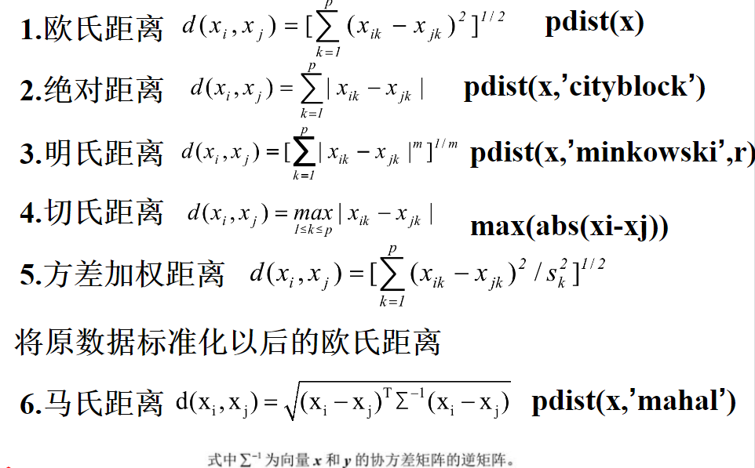

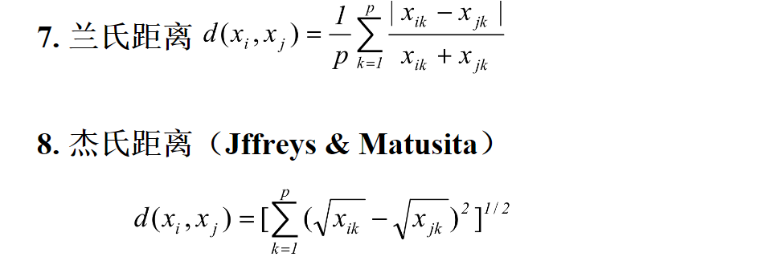

假设有n个样本，则通过计算它们之间的 **距离** ，可以构造 n*n 的对称矩阵，它的对角线上为0代表一个样品到自身的距离。

### 2、变量间

变量间的相似度量， **相似系数** ：当对p个指标变量进行聚类时，用相似系数来衡量变量之间的相似程度（关联度）

相似系数满足：（α，β指两个变量，C即它们的相似系数）

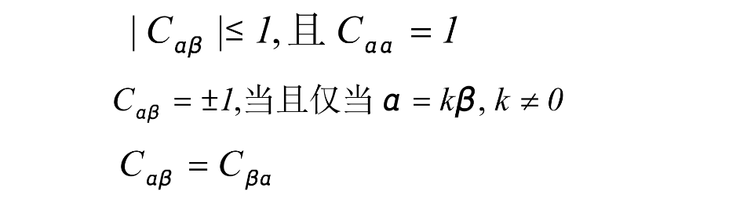

相似系数中最常用的是 **相关系数** 与 **夹角余弦** 。

#### 夹角余弦

这里的夹角是指： *指标向量*（即某一指标在所有样本中的属性值，组成的n维向量。假设样本有n个即n行）

类比：样本仅用2个就成为了二维向量（转化成单位向量），两个**指标的相似系数 **可用它们在空间中的夹角（无论是n维空间，向量都有夹角）表示。

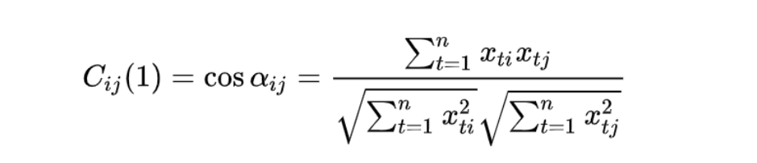

matlab代码（用**normc**和**矩阵相乘**，算出两指标的**夹角余弦**）

> a1=normc(a); % 将a的各列化为单位向量
> J=a1’*a1  % 计算a中各列之间的夹角余弦

#### 相关系数

matlab代码

> R=corrcoef(a);% 指标之间的相关系数

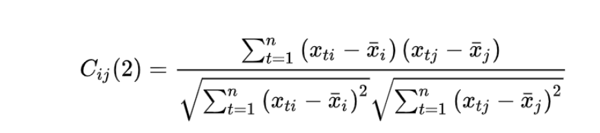

上图中的 `x` 是样本（行）和指标（列）的矩阵。

### 3、聚类间

主要是样本组成的聚类之间的距离。

样本的距离早已定义过了，例如前面的 **欧氏距离** ，这里定义聚类的距离。

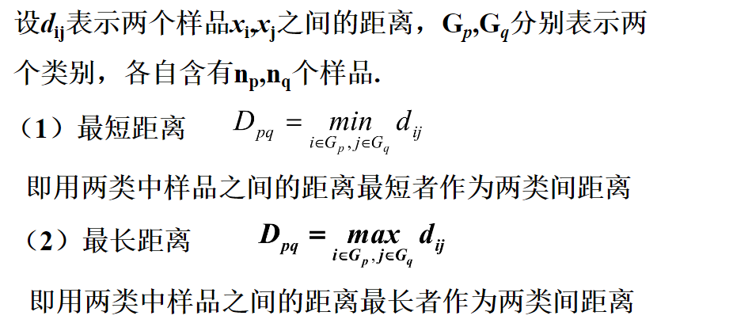

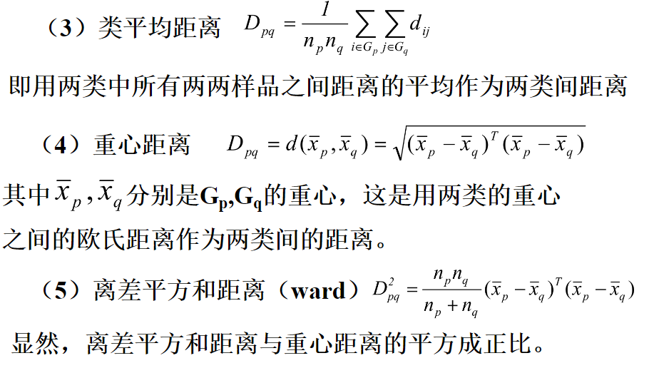

在课堂中使用的是第一种，最短距离，作为类间距离。

## 谱系聚类法

### 步骤

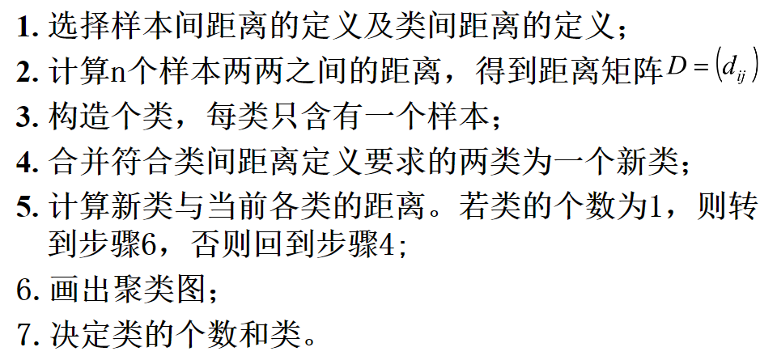

这里没有给出 **类与类之间的距离 **的限定，如果 **类间距离** 无限，最终会将所有样本都归为一类。

基本思想就是将最初的样本都作为单独的类，然后逐渐合并。

### 例子

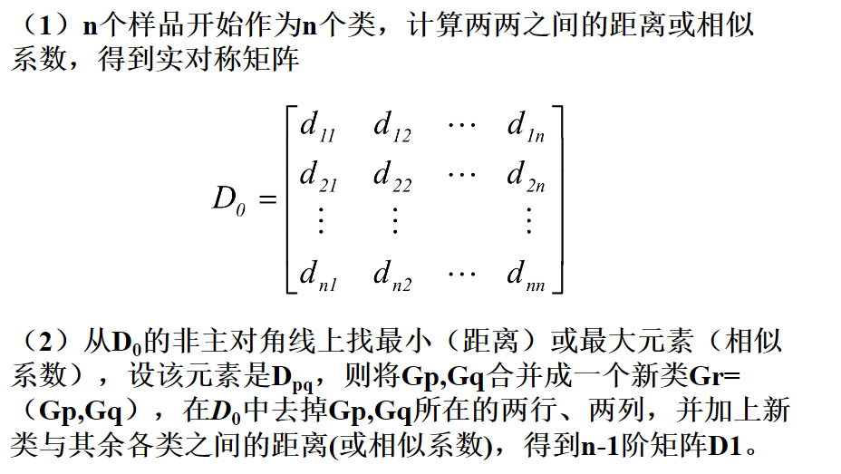

这里先去掉合并的两个样本/类，到其他类的距离，再根据 **类间距离** 的定义，在 **距离矩阵** 中加入新的距离（行、列）

#### 系谱聚类图

表示在y（类间聚类下），样本或变量可以分为几类。

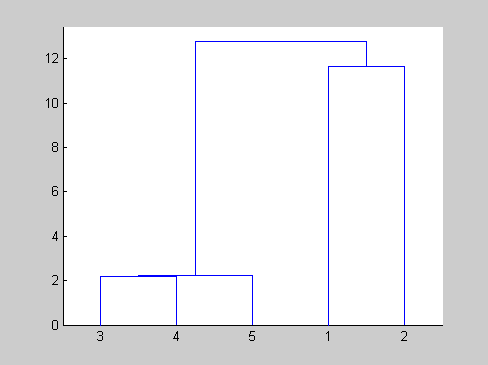

## K-平均聚类算法

### 基本思想

1. 首先，随机的选择k个对象，每个对象初始的代表了一个簇的平均值
2. 对剩余的每个对象，根据其与各个簇中心的距离，将它赋给最近的簇
3. 然后重新计算每个簇的平均值。
4. 这个过程不断重复，直到准则函数收敛。

### 收敛函数

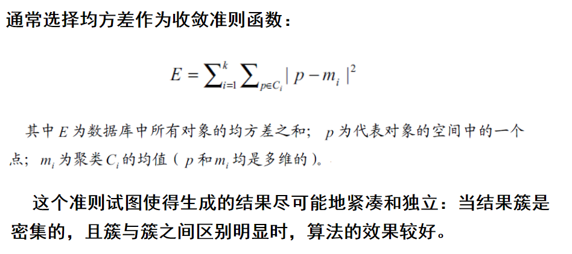

## 总结

### 聚类 vs 分类

聚类与分类的区别：聚类是一种无（教师）监督的学习方法。与分类不同，其不依赖于事先确定的数据类别，以及标有数据类别的学习训练样本集合。

因此，聚类是观察式学习，而不是示例式学习。

### 实际应用

聚类分析的应用：

- 市场分析：帮助市场分析人员从客户基本库中发现不同的客户群，并用购买模式刻画不同的客户群的特征
- 万维网：对WEB日志的数据进行聚类，以发现相同的用户访问模式
- 图像处理
- 模式识别
- 孤立点检测等